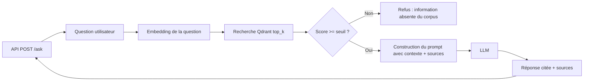
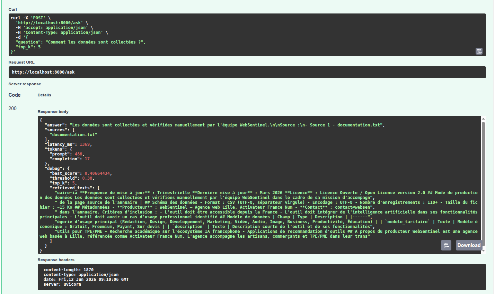
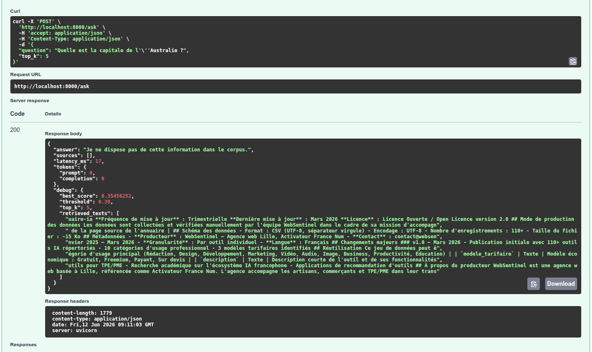

# Compte rendu - Projet A : AssistKB Search

-----

## 1\. Presentation

  - **Equipe** : MIA IPSSI
  - **Membres et roles** :
  - Cécile Audrée Demeuni - R1 Data / Ingestion
  - Dina Chaouki - R2 Embeddings / Index
  - Aurélie Demure - R3 Retrieval / LLM
  - Cécile Audrée Demeuni / Aurélie Demure - R4 DevOps / Observabilite
  - **Projet** : A - AssistKB Search (vector store Qdrant)
  - **Depot GitHub** : https://github.com/Cecileaudree/AssistKB-Search

## 2\. Objectif

> En 5 lignes : que fait votre RAG, sur quel corpus, pour quel besoin
> (lien fil rouge AssistKB-Neosoft).

## 3\. Architecture

## 4\. Fonctionnement

> Le parcours d'une question, etape par etape : reception API -\>
> embedding -\> recherche Qdrant -\> seuil de refus -\> prompt -\> LLM
> -\> reponse + sources.

Le parcours complet est le suivant :

1. réception de la question via `/ask` ;
2. génération de l’embedding de la question ;
3. recherche des chunks pertinents dans Qdrant ;
4. comparaison du meilleur score avec le seuil de similarité ;
5. refus si le contexte est insuffisant ;
6. construction du prompt si le contexte est accepté ;
7. appel au LLM ;
8. retour de la réponse avec les sources.

Cette organisation permet d’avoir un RAG capable à la fois de répondre lorsque l’information est présente dans le corpus et de refuser lorsqu’elle ne l’est pas.

### Ingestion

### Index / Embeddings

### Retrieval / Generation

La partie **Retrieval / Generation** correspond au cœur du fonctionnement du RAG. Elle permet de rechercher les chunks les plus pertinents dans Qdrant, de vérifier si le contexte trouvé est suffisamment fiable, puis de générer une réponse à partir de ces sources.

#### Recherche des chunks avec `retrieve.py` 
Le fichier `app/retrieve.py` contient la logique de recherche documentaire. Lorsqu’une question est posée par l’utilisateur, elle est d’abord transformée en vecteur grâce au modèle d’embeddings. Ce vecteur est ensuite utilisé pour interroger Qdrant et récupérer les chunks les plus proches de la question.

La recherche utilise le paramètre `top_k`, qui détermine le nombre de chunks retournés. Plusieurs valeurs ont été testées (`top_k=3`, `top_k=5` et `top_k=8`) afin de mesurer leur impact sur la qualité du contexte transmis au LLM (cf tableau dans Infra / Métriques).

Les résultats montrent que le meilleur score moyen reste identique quelle que soit la valeur de `top_k`. Cela signifie que le meilleur chunk est retrouvé dans tous les cas. En revanche, le score moyen des chunks diminue lorsque `top_k` augmente. Un `top_k` trop élevé ajoute donc des chunks moins pertinents, ce qui peut introduire du bruit dans le contexte.

La valeur `top_k=5` a été retenue comme compromis : elle fournit davantage de contexte que `top_k=3`, tout en évitant le bruit plus important observé avec `top_k=8`.

#### Seuil de similarité et refus anti-hallucination (cf tableau dans Infra / Métriques)

Pour limiter les hallucinations, un seuil de similarité a été ajouté. Après la recherche dans Qdrant, le système analyse le meilleur score obtenu. Si ce score est inférieur au seuil défini, la question est considérée comme insuffisamment couverte par le corpus.

Dans ce cas, le système refuse de répondre et retourne un message de type :

> Je ne dispose pas de cette information dans le corpus.

Ce mécanisme évite d’envoyer au LLM un contexte trop faible ou non pertinent, ce qui réduit le risque de générer une réponse inventée.

Le seuil retenu est `0.38`. Ce choix a été fait après comparaison entre des questions hors corpus et des questions présentes dans le corpus. Les questions hors corpus obtenaient des scores inférieurs ou proches de ce seuil, tandis que les questions réellement présentes dans le corpus obtenaient des scores supérieurs. Le seuil de `0.38` constitue donc un compromis entre deux risques : refuser trop de vraies questions si le seuil est trop haut, ou accepter des questions hors corpus si le seuil est trop bas (cf tableau dans Infra / Métriques).

#### Génération de la réponse avec `generate.py`

Le fichier `app/generate.py` construit le prompt envoyé au LLM. Ce prompt contient la question de l’utilisateur ainsi que les chunks récupérés par le retrieval. L’objectif est de forcer le modèle à répondre uniquement à partir du corpus fourni.

Le prompt est conçu pour limiter les inventions : le LLM doit s’appuyer sur les sources transmises et ne pas répondre si l’information n’est pas présente dans le contexte. Cette logique complète le seuil de similarité : le retrieval filtre d’abord les questions trop éloignées du corpus, puis le prompt encadre la génération pour éviter les réponses non sourcées.

La réponse finale contient :

* la réponse générée ;
* les sources utilisées ;
* les informations liées aux tokens ;
* les informations de latence si elles sont disponibles.

#### Endpoint `/ask` avec `api.py`

Le fichier `app/api.py` expose l’endpoint `POST /ask`. Cet endpoint reçoit la question de l’utilisateur, appelle la chaîne de traitement RAG, puis retourne une réponse structurée.

## 5\. Structure du projet

- `app/` : logique principale du projet
  - `api.py` : serveur FastAPI exposant `/ask` et `/health`
  - `llm.py` : appel du LLM Google Gemini
  - `retrieve.py` : recherche de chunks les plus pertinents dans Qdrant
  - `store.py` : gestion du store Qdrant
  - `embed.py` : génération d'embeddings et indexation
  - `generate.py` : construction du prompt et réponses basées sur le corpus
  - `ingest.py` : extraction et découpage du corpus en `corpus/chunks.jsonl`
- `fetch_corpus.ps1` : récupération de données publiques (`cert-fr`, `cnil`, `data.gouv`)
- `docker-compose.yml` : déploie Qdrant, l'indexeur et l'API
- `Dockerfile` : image Python pour l'application
- `requirements.txt` : dépendances Python
- `corpus/` : dossiers de données et chunks générés (ignoré par Git)

## 6\. Choix techniques (le pourquoi)

| Choix | Valeur retenue | Justification |
|---|---|---|
| Modèle embeddings | `all-MiniLM-L6-v2` | _____ |
| Vector store | `Qdrant` | _____ |
| Distance | _____ | _____ |
| `chunk_size` / overlap | _____ / _____ | _____ |
| `top_k` | `5` | Valeur retenue comme compromis : elle fournit plus de contexte que `top_k=3`, tout en évitant le bruit plus important observé avec `top_k=8`. |
| Seuil de refus | `0.38` | Seuil retenu pour limiter les hallucinations : il permet de refuser les questions hors corpus tout en conservant les questions pertinentes du corpus testées. |
| LLM | `Google Gemini` | Modèle utilisé pour générer la réponse finale à partir des chunks récupérés. Le prompt encadre la génération afin de répondre uniquement à partir des sources fournies. |

## 7\. Resultats / metriques

| Metrique | Valeur | Commentaire |
|---|---:|---|
| Score similarite moyen (top-k) | 0.366 | score moyen des chunks avec `top_k=5`, valeur retenue |
| Taux de refus (questions hors corpus) | 100 % | avec le seuil final fixé à `0.38` |
| Latence p50 / p95 | 1561 / 4223 ms | mesures indicatives sur 6 questions |
| Tokens moyens (prompt + completion) | 345.33 | moyenne sur toutes les questions, refus inclus |
| Cout projete "si paye" / 1000 questions | Non estimé | dépend du modèle LLM et de sa tarification |

#### Choix du seuil de refus (anti-hallucination) :

| Question | Type | Meilleur score | Seuil | Attendu | Obtenu | Source top 1 |
|---|---|---:|---:|---:|---|---|
| Quelle est la météo demain ? | hors_corpus | 0.286 | 0.38 | refus | refus | documentation.txt |
| Qui a gagné la Coupe du monde 2018 ? | hors_corpus | 0.365 | 0.38 | refus | réponse | documentation.txt |
| Quelle est la recette de la tarte aux pommes ? | hors_corpus | 0.304 | 0.38 | refus | refus | documentation.txt |
| Quelle est la capitale du Japon ? | hors_corpus | 0.318 | 0.38 | refus | refus | documentation.txt |
| Quels sont les critères d'inclusion d'un outil ?  | dans_corpus | 0.572 | 0.38 | réponse | réponse | documentation.txt |
| Comment les données sont elles collectées ?  | dans_corpus | 0.385 | 0.38 | réponse | réponse | documentation.txt |
| Quelle est la fréquence de mise à jour du jeu de données ? | dans_corpus | 0.457 | 0.38 | réponse | réponse | documentation.txt |
| Combien d’outils IA sont recensés dans l’annuaire ? | dans_corpus | 0.448 | 0.38 | réponse | réponse | documentation.txt |

Lors d’un premier test avec un seuil fixé à 0.35, trois questions hors corpus sur quatre ont été refusées correctement.  
Cependant, la question sur la coupe du monde 2018 a obtenu un score de similarité de 0.36 et a donc été acceptée à tort.  
Ce résultat montre que le seuil initial était trop bas. Le seuil a été ajusté au-dessus du score maximal observé sur les questions hors corpus, afin de réduire le risque d’hallucination à 0.38.
Des tests ont été également réalisés sur des questions en lien avec le corpus afin de s'assurer qu'elles ne sont pas éliminées par le seuil fixé. 

#### Choix du top_k : 

| top_k | Meilleur score moyen | Score moyen des chunks | Sources top 1 | Commentaire |
|---:|---:|---:|---|---|
| 3 | 0.471 | 0.407 | documentation.txt |  |
| 5 | 0.471 | 0.366 | documentation.txt |  |
| 8 | 0.471 | 0.307 | documentation.txt |  |

Trois valeurs de `top_k` : 3, 5 et 8 ont été testées, uniquement sur des questions présentes dans le corpus.

Le meilleur score moyen reste identique pour les trois valeurs testées (`0.471`), ce qui indique que le meilleur chunk est retrouvé quelle que soit la valeur de `top_k`.

En revanche, le score moyen des chunks diminue lorsque `top_k` augmente : `0.407` pour `top_k=3`, `0.366` pour `top_k=5` et `0.307` pour `top_k=8`. Cela montre qu’ajouter davantage de chunks apporte des passages moins pertinents, donc davantage de bruit dans le contexte envoyé au LLM.

Sur ce corpus, `top_k=3` serait suffisant. Cependant, le choix est fait de conserver `top_k=5` pour garder un peu plus de contexte si une réponse nécessite plusieurs chunks.

#### Mesures par question :

| Question | Décision | Latence ms | Tokens prompt | Tokens completion | Tokens total |
|---|---|---:|---:|---:|---:|
| Quels sont les critères d'inclusion d'un outil ? | réponse | 4223.0 | 480 | 47 | 527 |
| Comment les données sont-elles collectées ? | réponse | 1835.0 | 488 | 39 | 527 |
| Quelle est la fréquence de mise à jour du jeu de données ? | réponse | 1338.0 | 485 | 24 | 509 |
| Combien d’outils IA sont recensés dans l’annuaire ? | réponse | 1784.0 | 480 | 29 | 509 |
| Quelle est la météo demain ? | refus | 12.0 | 0 | 0 | 0 |
| Quelle est la recette de la tarte aux pommes ? | refus | 8.0 | 0 | 0 | 0 |

#### Synthèse des mesures par question :

| Métrique | Valeur |
|---|---:|
| Latence moyenne | 1533.33 ms |
| Latence p50 | 1561.0 ms |
| Latence p95 | 4223.0 ms |
| Tokens moyens | 345.33 |

Interprétation des métriques d’exploitation

Les métriques d’exploitation ont été relevées sur six questions posées à l’endpoint `/ask` : quatre questions présentes dans le corpus et deux questions hors corpus.

Les résultats montrent une différence nette entre les questions acceptées et les questions refusées. Les questions présentes dans le corpus obtiennent une réponse générée par le LLM. Elles ont donc une latence plus élevée, comprise entre `1338 ms` et `4223 ms`, car le traitement inclut la recherche des chunks, la construction du prompt et l’appel au modèle de génération.

À l’inverse, les questions hors corpus sont refusées très rapidement, avec une latence de `8 ms` à `12 ms`. Dans ces cas, le seuil de similarité permet d’arrêter le traitement avant l’appel au LLM. Cela explique également pourquoi les tokens sont à `0` pour les refus : aucun prompt n’est envoyé au modèle de génération.

Les tokens consommés par les questions acceptées restent relativement proches : entre `509` et `527` tokens au total. La majorité des tokens correspond au prompt, c’est-à-dire aux consignes, à la question et aux chunks transmis au LLM. Les tokens de génération sont beaucoup plus faibles, entre `24` et `47`, ce qui indique que les réponses produites restent courtes.

La latence moyenne est de `1533.33 ms`, mais cette moyenne est fortement influencée par les refus très rapides. La latence p50 est de `1561 ms`, ce qui donne une idée plus représentative du temps de réponse médian. La latence p95 atteint `4223 ms`, ce qui correspond au cas le plus lent observé dans ce petit échantillon.

Ces mesures montrent que le système est plus coûteux en temps et en tokens lorsqu’une réponse est générée, mais qu’il est capable de refuser très rapidement les questions hors corpus. Le mécanisme de seuil de similarité joue donc un double rôle : il limite les hallucinations et évite des appels inutiles au LLM.

#### Exemples de questions / réponses

Exemple d’une question présente dans le corpus :

Exemple d’une question hors corpus refusée :

## 8\. Difficultes et limites

> Ce qui n'a pas marche, ce que vous feriez avec plus de temps.

-----

## 9\. (Bonus) Evaluation - golden dataset

> 10 questions de reference avec la source attendue. recall@k mesure.

## 10\. (Bonus) Reranking

> Effet du cross-encoder sur la pertinence (avant/apres).

## 11\. (Bonus) Pistes d'amelioration

> Recherche hybride (BM25 + vectoriel), optimisation cout/latence, etc.
